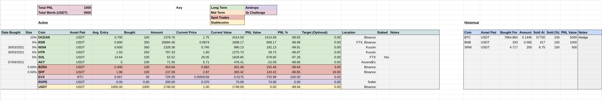

# service: s.googlesheets

This service handles all functionality with regards to googlesheets.
Currently is only provides syncing functionality to a googlesheet for a portfolio.
This portfolio must be of a certain schema in order to work. As such syncing is schema-on-read.

Any failure to read the schema, the service will page the designated owner every 12h at least until
the issue is resolved.

